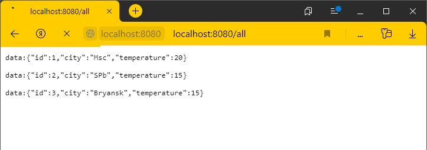
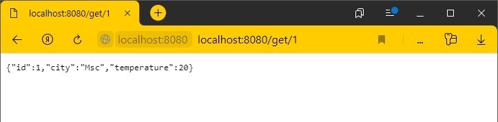
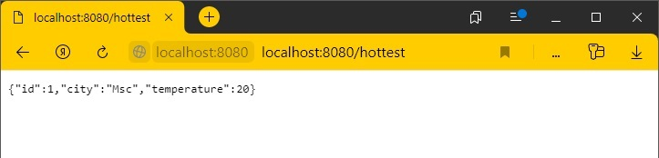
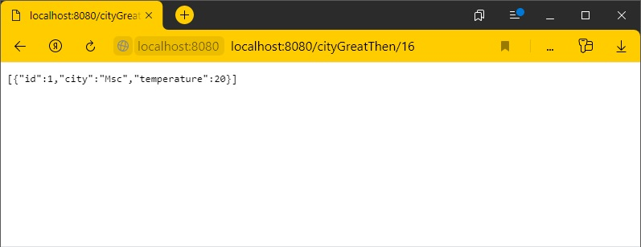

# Wheater reactive

<h2>О проекте:</h2>

Прогноз погоды.
 

Работает в режиме реактивного программирования. (Spring boot Webflux)

Приложение имеет 4 запроса: 

    1. /all - Показать список всех городов с погодой.    

  
    
    2. /get/{id} - Показать детальную погоду по выбранному городу.
    id - Идентификатор города.
    
    
    
    3. /hottest - Возвращает город с максимальной температурой.
    
   
    
    4. /cityGreatThen/{temp} - Возвращает города с температурой выше указанной в запросе.
    temp - Значение температуры.
    
    
  
<h2>Контакты:</h2>
Если у вас есть вопросы, не стесняйтесь обращаться.
Электронная почта: andykirill@gmail.com